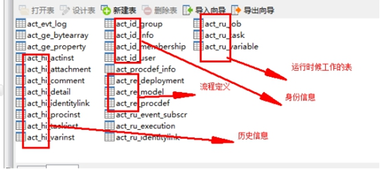
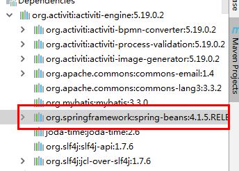
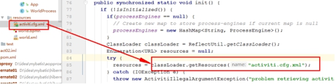
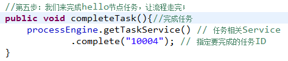
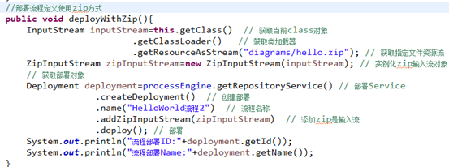
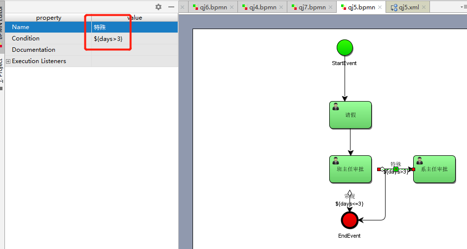
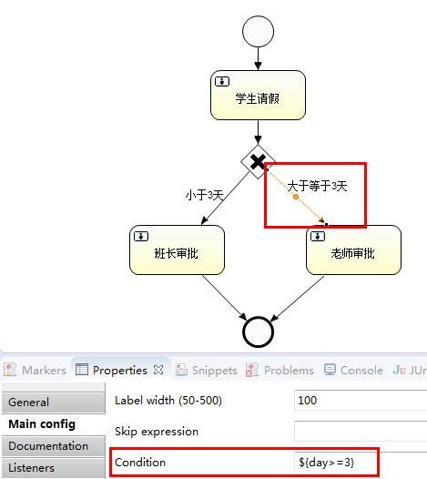
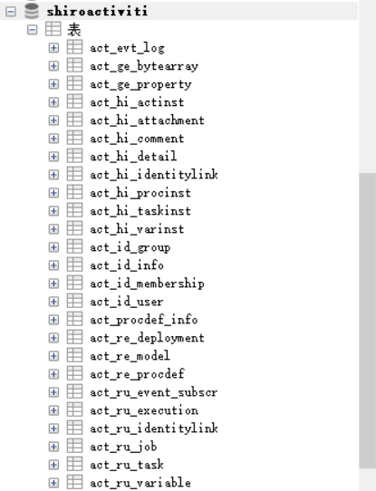
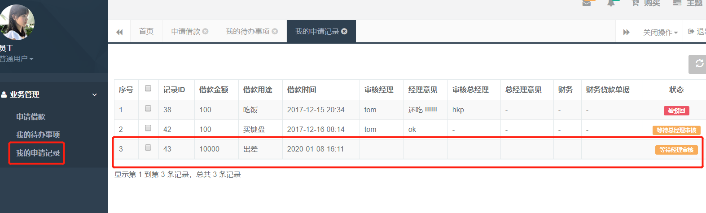
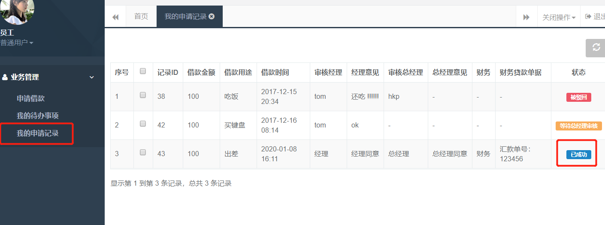

**完整代码（Springboot+Shiro+Activiti）与资料下载，问题交流，请加QQ群，群号（1047661092）**


# Activti工作流

## 第一章 工作流介绍

> ##### 第一章示例代码见工程：code/act01

Activiti是一个项目的名称，Alfresco软件在2010年5月17日宣布Activiti业务流程管理（BPM）开源项目的正式启动，其首席架构师由业务流程管理BPM的专家 Tom Baeyens担任。

Activiti项目是一项新的基于Apache许可的开源BPM平台，从基础开始构建，旨在提供支持新的BPMN 2.0标准，包括支持对象管理组（OMG），面对新技术的机遇，诸如互操作性和云架构，提供技术实现。

创始人Tom Baeyens是JBoss jBPM的项目架构师，以及另一位架构师Joram Barrez，一起加入到创建Alfresco这项首次实现Apache开源许可的BPMN 2.0引擎开发中来。

Activiti是一个独立运作和经营的开源项目品牌，并将独立于Alfresco开源ECM系统运行。 Activiti将是一种轻量级，可嵌入的BPM引擎，而且还设计适用于可扩展的云架构。 Activiti将提供宽松的Apache许可2.0，以便这个项目可以广泛被使用，同时促进Activiti BPM引擎和的BPMN 2.0的匹配，该项目现正由OMG通过标准审定。

Activiti官方主页：http://www.activiti.org/index.html

下载：http://www.activiti.org/download.html

用户指南：http://activiti.org/userguide/index.html  （用户指南来学习Activiti）

在线API文档： http://activiti.org/javadocs/index.html （开发的时候参阅）


### 1.1 什么是工作流?

以请假为例，现在好多中小公司请假流程是这样的

**没有系统支撑：**

> 员工打电话（或网聊）向上级提出请假申请——上级口头同意——上级将请假记录下来——月底将请假记录上交公司——公司将请假录入电脑
>

**采用工作流技术的公司的请假流程是这样的**:

> 员工使用账户登录系统——点击请假——上级登录系统点击允许
>

就这样，一个请假流程就结束了。

有人会问，那上级不用向公司提交请假记录？公司不用将记录录入电脑？答案是，用的。但是这一切的工作都会在上级点击允许后自动运行！这个些信息会自动的计入到数据库。随时支持查询，不需要再手动录入。

这就是工作流技术

Georgakopoulos给出的工作流定义是：工作流是将一组任务组织起来以完成某个经营过程：定义了任务的触发顺序和触发条件，每个任务可以由一个或多个软件系统完成，也可以由一个或一组人完成，还可以由一个或多个人与软件系统协作完。**


 

### 1.2 工作流技术的优点

从上面的例子，很容易看出

工作流系统，实现了工作流程的**自动化，提高了企业运营效率**、改善企业资源利用、提高企业运作的灵活性和适应性、提高量化考核业务处理的效率、减少浪费（时间就是金钱）。

而手工处理工作流程，一方面无法对整个流程状况进行有效跟踪、了解，另一方面难免会出现人为的失误和时间上的延时导致效率低下，特别是无法进行量化统计，不利于查询、报表及绩效评估。

**Java开发者会为什么要学activiti工作流**

在Java领域，JBPM和activiti是两个主流的工作流系统，而activiti的出现无疑将会取代JBPM（**activiti**的开发者就是从Jbpm开发者出来的）。

应用场景：

1）审批环节[维修审批，服务器审批，贷款审批....]

2）请假环节[学员请假，员工请假....]

<font color=red >**"图"转换编程能力：**</font>

<font color=red>**画图->xml文档-->编程解析**</font>

 

### 1.3 工作流的图如何画？

#### 第一步：idea插件 在线安装

File - settings-plugins-Browse Repositories 搜索 actiBPM   双击搜索结果或点击Install plugin安装


安装：


或者本地安装(Idea2018)：


重启：


 


 

 重启Idea

  

#### 第二步：新建Maven普通项目，画工作流的流程图

新建bpmn文件:放入资源文件resources目录。


Idea中:


Idea中注意箭头的画法:


 注意：画图的时候需要思考，一个任务分配给谁执行呢？(当前任务)

工作流画的是公司的公共流程，针对所有人。工作流是**一套公共的模板流程。**

本质：这个请假流程图只需要画一次，就可以给公司的所有员工使用。


  这里处理任务给的具体人。后期需要使用变量的方式做成通用流程。

(给属性Assignee赋值)


### 1.4 工作流的设计表

Activiti的运行支持，必须要有Activiti的25张表，主要是在流程运行过程中，记录存储一些参与流程的用户主体，组，以及流程定义的存储，流程执行时候的一些信息，以及流程的历史信息等.

#### 第一步：创建maven项目,导入依赖

```xml
<!--添加Activiti工作流的支持 一般需要exclusions -->
<dependency>
  <groupId>org.activiti</groupId>
  <artifactId>activiti-engine</artifactId>
  <version>5.19.0.2</version>
</dependency>
<!--添加Activiti工作流对Spring的支持-->
<dependency>
  <groupId>org.activiti</groupId>
  <artifactId>activiti-spring</artifactId>
  <version>5.19.0.2</version>
</dependency>
<dependency>
  <groupId>org.activiti</groupId>
  <artifactId>activiti-bpmn-model</artifactId>
  <version>5.19.0.2</version>
</dependency>
 <!-- mysql驱动:根据数据库的版本选择驱动版本 -->
<dependency>
  <groupId>mysql</groupId>
  <artifactId>mysql-connector-java</artifactId>
  <version>5.1.34</version>
</dependency>
```

#### **第二步：生成工作流表方案一（非配置方式）**

1. 先手动创建db_activiti数据库

2. 开发代码：如下

3. 获取流程引擎配置

4. 配置驱动包，url

5. 数据库用户名，密码

6. schema要设置成update


**加载配置类**

org.activiti.engine.ProcessEngineConfiguration

**引擎类**

org.activiti.engine.ProcessEngine

```java 
package com.qf.act;

import org.activiti.engine.ProcessEngine;
import org.activiti.engine.ProcessEngineConfiguration;

public class InitActivitiTable {
    //生成工作流需要的表
    public void initTable(){
        //流程引擎的配置对象，这种方式不需要配置文件
        ProcessEngineConfiguration engineConfiguration = ProcessEngineConfiguration.createStandaloneProcessEngineConfiguration();
        engineConfiguration.setJdbcDriver("org.gjt.mm.mysql.Driver");
        engineConfiguration.setJdbcUrl("jdbc:mysql:///qf?characterEncoding=utf-8");
        engineConfiguration.setJdbcUsername("root");
        engineConfiguration.setJdbcPassword("");
        //设置表的更新
        engineConfiguration.setDatabaseSchemaUpdate(ProcessEngineConfiguration.DB_SCHEMA_UPDATE_TRUE);
        //上面的代码就是加载配置,然后需要得到工作流的核心对象
        ProcessEngine processEngine = engineConfiguration.buildProcessEngine();
        //后续将使用ProcessEngine来操作工作流的表
    }

    public static void main(String[] args) {
        InitActivitiTable actDAO = new InitActivitiTable();
        actDAO.initTable();
    }

}
```

刷新数据库，即可看到25张表 


**5种类型数据库表说明：**

Activiti的后台是有数据库的支持，所有的表都以ACT_开头。 第二部分是表示表的用途的两个字母标识。用途也和服务的API对应。

`ACT_RE_*:` 'RE'表示repository。 这个前缀的表包含了流程定义和流程静态资源 （图片，规则，等等）。

`ACT_RU_*:` 'RU'表示runtime。 这些运行时的表，包含流程实例，任务，变量，异步任务，等运行中的数据。 Activiti只在流程实例执行过程中保存这些数据， 在流程结束时就会删除这些记录。 这样运行时表可以一直很小速度很快。

`ACT_ID_*: `'ID'表示identity。 这些表包含身份信息，比如用户，组等等。

`ACT_HI_*:` 'HI'表示history。 这些表包含历史数据，比如历史流程实例， 变量，任务等等。

`ACT_GE_*: `'GE'表示general。通用数据， 用于不同场景下，如存放资源文件。

这些表结构，还有一些辅助表。我们后续会详细解释，这里大家先大体了解即可；



  **详细表说明如下**：
	日志表：

> ##### act_evt_log                        存储事件处理日志，方便管理员跟踪处理。


   通用数据表：

> ##### act_ge_bytearray               二进制数据表，一些文件存在这个表。
>
> ##### act_ge_property                属性数据表存储整个流程引擎级别的数据,初始化表结构时，会默认插入三条记录


   历史数据表

> ##### act_hi_actinst                    历史节点表
>
> ##### act_hi_attachment             历史附件表
>
> ##### act_hi_comment                历史意见表
>
> ##### act_hi_detail                      历史详情表，提供历史变量的查询
>
> ##### act_hi_identitylink              历史流程人员表
>
> ##### act_hi_procinst                  历史流程实例表
>
> ##### act_hi_taskinst                 历史任务实例表
>
> ##### act_hi_varinst                   历史变量表


用户组织表

> ##### act_id_group                    用户组信息表
>
> ##### act_id_info                       用户扩展信息表
>
> ##### act_id_membership         用户与用户组对应信息表
>
> ##### act_id_user                      用户信息表


资源流程规则表

> ##### act_procdef_info              流程定义信息
>
> ##### act_re_deployment          部署信息表
>
> ##### act_re_model                   流程设计模型部署表
>
> ##### act_re_procdef                 流程定义数据表  


运行时数据库表

> ##### act_ru_event_subscr       监听表
>
> ##### act_ru_execution             运行时流程执行实例表
>
> ##### act_ru_identitylink           运行时流程人员表，主要存储任务节点与参与者的相关信息
>
> ##### act_ru_job                       运行时定时任务数据表
>
> ##### act_ru_task                     运行时任务节点表
>
> ##### act_ru_variable               运行时流程变量数据表

#### 第三步：生成工作流表方案二(配置方式,推荐)

整合到Spring的配置文件中 

默认的配置文件名称就是：activiti.cfg.xml

activiti.cfg.xml配置简化创建表功能

1. 文档:http://activiti.org/userguide/index.html#configuration 

2. resources下创建一个xml文件 名字是：activiti.cfg.xml

3. org.activiti.engine.impl.cfg.StandaloneProcessEngineConfiguration

配置代码： 

**这里的核心就是运用了 Spring的能力(IOC+DI)**

```xml
<?xml version="1.0" encoding="UTF-8"?>
<beans xmlns="http://www.springframework.org/schema/beans"
       xmlns:xsi="http://www.w3.org/2001/XMLSchema-instance"
       xsi:schemaLocation="http://www.springframework.org/schema/beans   
      http://www.springframework.org/schema/beans/spring-beans.xsd">
   <!-- 创建工作流引擎的核心对象
   id的名称不可以修改
   -->
    <!-- IOC,DI -->
    <bean id="processEngineConfiguration" class="org.activiti.engine.impl.cfg.StandaloneProcessEngineConfiguration">
        <!-- 加载数据源 -->
        <property name="jdbcDriver" value="org.gjt.mm.mysql.Driver"></property>
        <property name="jdbcUrl" value="jdbc:mysql:///db_activiti?characterEncoding=utf-8"></property>
        <property name="jdbcUsername" value="root"></property>
        <property name="jdbcPassword" value=""></property>
        <!-- 设置数据库表的更新-->
        <property name="databaseSchemaUpdate" value="true"></property>
    </bean>
    
</beans>
```

```java
package com.qf.act;

import org.activiti.engine.ProcessEngine;
import org.activiti.engine.ProcessEngineConfiguration;

public class InitActivitiTable {
    public void initTable1(){
        //加载配置
        ProcessEngineConfiguration processEngineConfiguration = ProcessEngineConfiguration.createProcessEngineConfigurationFromResource("activiti.cfg.xml");
        //得到引擎对象
        ProcessEngine processEngine = processEngineConfiguration.buildProcessEngine();
    }

    public static void main(String[] args) {
        InitActivitiTable actDAO = new InitActivitiTable();
        actDAO.initTable1();
    }

}
```

**注意：**这里定义的id名称必须为`processEngineConfiguration`，因为加载配置的时候，在源码中加载用的就是这个名称。


 

测试观察结果：


 

**深入理解：**

这里没有导入Spring 的包，但是为什么可以使用 Spring的Bean的管理能力?

其实这里已经由Spring整合了工作流。（这里使用了Spring的核心之一 bean 的管理IOC+DI）


**依赖传递：**



 


也就是这个开源项目，在开发的时候就已经加入了 spring的包。

**同时注意：**这里它默认加入的spring的版本是4.1.5.未来整合到项目中的时候，可能和项目中的spring的包产生冲突。项目中把工作流引擎的包放到最后,加载顺序是从前到后，这样可以不需要排除可能的冲突。

 

**认识流程图的本质**

画流程图

1. Idea中点击到具体任务，可看到Assignee任务分配属性


 


2. 把bpmn文件后缀改成xml,右键选择Diagrams->Show BPMN 2.0 Designer

复制一份bpmn文件重命名变为xml:


图和xml文件是一一对应的：


```xml
<!--process 流程引擎的节点id="myProcess_1" 流程的唯一标示 点击流程图的空白地方可以看见-->
<process id="myProcess_1" isClosed="false" isExecutable="true" processType="None">
    <startEvent id="_2" name="StartEvent"/><!-- 开始节点 -->
    <endEvent id="_3" name="EndEvent"/><!-- 结束节点 -->
    <!-- 用户任务 执行者 assignee="班长" -->
    <userTask activiti:assignee="班长" activiti:exclusive="true" id="_4" name="请假"/>
    <!-- 连线 第一根： sourceRef="_2" 开始 targetRef="_4" 用户任务 -->
    <sequenceFlow id="_5" sourceRef="_2" targetRef="_4"/>
    <!-- 连线 第一根： sourceRef="_4"  用户任务 targetRef="_3" 结束节点-->
    <sequenceFlow id="_6" sourceRef="_4" targetRef="_3"/>
</process>
```


3. 在XML视图中点击Export to file，选择png格式，得到png文件 

​    Idea中导出为图片：**（了解）Eclipse中可以自动生成。**


这样也是正常的，本身不需要生成，会自动生成到数据库中去。

**工作流的流程图本质仍然是XML 文件**

```xml
<?xml version="1.0" encoding="UTF-8" standalone="yes"?>
<definitions xmlns="http://www.omg.org/spec/BPMN/20100524/MODEL" xmlns:activiti="http://activiti.org/bpmn" xmlns:bpmndi="http://www.omg.org/spec/BPMN/20100524/DI" xmlns:omgdc="http://www.omg.org/spec/DD/20100524/DC" xmlns:omgdi="http://www.omg.org/spec/DD/20100524/DI" xmlns:tns="http://www.activiti.org/test" xmlns:xsd="http://www.w3.org/2001/XMLSchema" xmlns:xsi="http://www.w3.org/2001/XMLSchema-instance" expressionLanguage="http://www.w3.org/1999/XPath" id="m1520922925726" name="" targetNamespace="http://www.activiti.org/test" typeLanguage="http://www.w3.org/2001/XMLSchema">
  <process id="myProcess_1" isClosed="false" isExecutable="true" processType="None">
    <startEvent id="_2" name="StartEvent"/>
    <endEvent id="_3" name="EndEvent"/>
    <userTask activiti:assignee="班主任" activiti:exclusive="true" id="_4" name="班主任"/>
    <sequenceFlow id="_5" sourceRef="_2" targetRef="_4"/>
    <sequenceFlow id="_6" sourceRef="_4" targetRef="_3"/>
  </process>
  <bpmndi:BPMNDiagram documentation="background=#FFFFFF;count=1;horizontalcount=1;orientation=0;width=842.4;height=1195.2;imageableWidth=832.4;imageableHeight=1185.2;imageableX=5.0;imageableY=5.0" id="Diagram-_1" name="New Diagram">
    <bpmndi:BPMNPlane bpmnElement="myProcess_1">
      <bpmndi:BPMNShape bpmnElement="_2" id="Shape-_2">
        <omgdc:Bounds height="32.0" width="32.0" x="165.0" y="-15.0"/>
        <bpmndi:BPMNLabel>
          <omgdc:Bounds height="32.0" width="32.0" x="0.0" y="0.0"/>
        </bpmndi:BPMNLabel>
      </bpmndi:BPMNShape>
      <bpmndi:BPMNShape bpmnElement="_3" id="Shape-_3">
        <omgdc:Bounds height="32.0" width="32.0" x="175.0" y="320.0"/>
        <bpmndi:BPMNLabel>
          <omgdc:Bounds height="32.0" width="32.0" x="0.0" y="0.0"/>
        </bpmndi:BPMNLabel>
      </bpmndi:BPMNShape>
      <bpmndi:BPMNShape bpmnElement="_4" id="Shape-_4">
        <omgdc:Bounds height="55.0" width="85.0" x="150.0" y="130.0"/>
        <bpmndi:BPMNLabel>
          <omgdc:Bounds height="55.0" width="85.0" x="0.0" y="0.0"/>
        </bpmndi:BPMNLabel>
      </bpmndi:BPMNShape>
      <bpmndi:BPMNEdge bpmnElement="_5" id="BPMNEdge__5" sourceElement="_2" targetElement="_4">
        <omgdi:waypoint x="181.0" y="17.0"/>
        <omgdi:waypoint x="181.0" y="130.0"/>
        <bpmndi:BPMNLabel>
          <omgdc:Bounds height="0.0" width="0.0" x="0.0" y="0.0"/>
        </bpmndi:BPMNLabel>
      </bpmndi:BPMNEdge>
      <bpmndi:BPMNEdge bpmnElement="_6" id="BPMNEdge__6" sourceElement="_4" targetElement="_3">
        <omgdi:waypoint x="191.0" y="185.0"/>
        <omgdi:waypoint x="191.0" y="320.0"/>
        <bpmndi:BPMNLabel>
          <omgdc:Bounds height="0.0" width="0.0" x="0.0" y="0.0"/>
        </bpmndi:BPMNLabel>
      </bpmndi:BPMNEdge>
    </bpmndi:BPMNPlane>
  </bpmndi:BPMNDiagram>
</definitions>
```

图转为xml的核心内容：process节点


 

### 1.5 工作流总结

1. 插件画图,后缀：bpmn ,图的本质是 xml文件。

2. 应用主要在审批环节，请假环节，公司内部一般都有这样的系统。

3. Activiti,已经设计好了所有表。25张表。

4. 生成表：一种编写代码设置数据库的属性生成；一种整合在Spring的配置文件中，加载配置文件生成。


## 第二章 流程实例部署与执行

> 第二章示例代码见工程：code/act01

创建Maven普通项目，画流程图

加入依赖和之前一致。


 这个工作流的图要想生效，要想任务执行，就需要读取这个图的内容，也就是需要把这个内容添加到工作流引擎的数据库中去。最终工作流的所有信息都会在工作流引擎的数据库中有记录。

### 2.1 部署流程

部署的位置起始就是工作流引擎的数据库。

**流程定义和流程实例**

1. 流程定义就是一个模版（我们画的流程图）

2. 流程实例就是通过模版实例出来具体可用的流程

#### 第一步：得到流程引擎对象

得到引擎默认会加载配置文件activiti.cfg.xml(复制过来)

定义一个部署方法后再开发代码：

注意导包：org.activiti.engine.ProcessEngine;

```java
//得到流程引擎对象
private ProcessEngine processEngine = ProcessEngines.getDefaultProcessEngine();
```

 底层有加载配置文件：也说明这个文件的名称不能修改。


看初始化的方法：


读取配置文件activiti.cfg.xml的内容：



#### 第二步：部署流程

注意导包：org.activiti.engine.repository.Deployment;

```java
//部署流程定义
public void deplory(){
   //得到部署的service
   RepositoryService repositoryService = processEngine.getRepositoryService();
   //部署
   Deployment deploy = repositoryService.createDeployment()
         .addClasspathResource("world.bpmn")//加载流程文件
		 .name("worldProcess")//流程名称
         .deploy();//部署
   //得到部署的信息
   System.out.println("部署ID"+deploy.getId());
}
```

部署流程名称可自定义


可不用添加图片，会自动生成加入库。

#### 第三步：测试

部署流程定义 数据库表发生更新

1)部署表：

act_re_deployment 流程定义部署表，插入了一条数据；


2)流程定义表：

act_re_prodef 流程定义表也会有插入一条数据

这里有流程定义id name key version等重要信息；

后面可以通过接口来获取这些数据；


这个key对应的流程定义图的ID


后面就可以根据这个唯一的key来启动流程


3)资源信息表：

act_ge_bytearray表 用来存资源信息,上传后的**原始文件**存储的地方。


 部署ID  20001

从工作角度，这个流程只需要部署一次，后面就可以多次使用。

### 2.2 启动流程实例

空白地方单击看Id，需要依靠这个ID启动，对应在数据库存储的是流程定义表中的key_字段。


对应：


#### 第一步：启动流程

数据库流程运行表也会发生相应的变化；
注意导包：org.activiti.engine.runtime.ProcessInstance


```java
public void start(){
   //得到运行service
   RuntimeService runtimeService = processEngine.getRuntimeService();
   //根据key(唯一ID标示)来启动流程实例
   ProcessInstance processInstance = runtimeService.startProcessInstanceByKey("worldProcess");
   //根据流程实例得到具体信息
   System.out.println("流程实例ID"+processInstance.getId());
   System.out.println("流程定义ID"+processInstance.getProcessDefinitionId());
}
```

#### 第二步：测试

运行后数据库：

1. 运行时流程任务表：act_ru_task；插入了一条任务数据；

   **任务表：（重点）**


任务ID：


谁执行任务：


**重要：ID_是任务id ；PROC_INST_ID_是流程实例ID**

- act_ru_execution 运行时流程执行表也更新

流程执行表存储流程执行相关信息；


- act_ru_identitylink 是于执行主体相关信息表更新

这里是用具体的用户去执行

执行主题信息表：


流程实例启动完，接下来就到了具体任务节点：


### 2.3 任务执行

查看指定用户的任务：

注意导包：org.activiti.engine.task.Task;

查询任务

```java
public void findTask(){
   //得到任务service
   TaskService taskService = processEngine.getTaskService();
   //查询
   List<Task> list = taskService.createTaskQuery()
         .taskAssignee("攻城狮")//按照指定人的名称查询
         .list();

   for (Task task : list) {
      System.out.println("任务ID"+task.getId());
      System.out.println("任务名称"+task.getName());
      System.out.println("执行者"+task.getAssignee());
      System.out.println("流程定义ID"+task.getProcessDefinitionId());
   }
}
```

输出如下：（说明用户有任务可执行）

> 任务ID22504
>
> 任务名称工程师请假
>
> 执行者攻城狮
>
> 流程定义IDworldProcess:1:20004

### 2.4 完成任务

继续走流程 执行completeTask方法



这里的参数任务id是字符串。

```java
//完成任务
public void completTask(){
   //得到任务service
   TaskService taskService = processEngine.getTaskService();
   taskService.complete("22504");
}
```

执行完后，流程其实就已经走完了。

再运行findTask，没有输出，已经没有任务了。


结束

**数据库表变化：** 

1. ru开头的运行时候所有表的数据都没了，因为现在流程都走完了。不需要那些数据了

2. hi开头的表里，存了不少数据，主要是用来归档查询用的

 

历史表中有记录：

3. act_hi_taskinst 历史流程实例任务表加了一条任务数据；

4. act_hi_procinst 历史流程实例实例表加了一条流程实例相关信息的数据（包括开始时间，结束时间等等信息）；

5. act_hi_identitylink 历史流程实例参与者的表加了一条数据；

6. act_hi_actinst 历史活动节点表加了三条流程活动节点信息的数据（每个流程实例具体的执行活动节点的信息,流程实例什么时候开始的，什么时候结束的）；

历史流程任务表：


历史流程实例表：


历史流程参与表：


 历史活动节点表：


 

### 2.5 总结

工作流框架自动操作底层数据库表，这个框架已经完成了所有持久层的操作,同时提供了服务层的各种service操作类。我们这里仅仅只需要编写流程业务。

**开发流程**

第一步：画流程图(通用模板) 流程定义 只需要定义一次。

第二步：部署流程图，需要把这个图部署到流程框架中，添加到数据库。 只需要一次。

第三步：启动流程实例（多次使用） **只需要关注任务表act_ru_task**

第四步：执行任务，完成当前自己的任务。（多次使用）


## 第三章 部署流程方案二(掌握)

> ##### 第三章示例代码见工程：code/act01

前面我们使用的是classpath加载资源文件方式来部署流程定义的。

若实际项目，需要来动态导入流程定义文件，通过把bpmn[+png文件]打包成zip压缩包，然后用户界面直接导入到系统，然后解析，部署流程定义。

### 第一步：打包

先画图。

把bpmn[+png]文件打成zip压缩包


 png文件可选

结果：


### 第二步：部署ZIP文件



 

```java
public void deployZIP(){
   //加载zip文件
   InputStream inputStream = this.getClass().getClassLoader().getResourceAsStream("world.zip");
   ZipInputStream zipInputStream = new ZipInputStream(inputStream);
   //得到部署的service
   RepositoryService repositoryService = processEngine.getRepositoryService();
   Deployment deploy = repositoryService.createDeployment()
         .addZipInputStream(zipInputStream)
         .name("worldProcess2")
         .deploy();
   //得到部署的信息
   System.out.println("部署ID"+deploy.getId());

}
```

部署后表变化和之前一致，后面执行流程和之前一致。

部署ID27501,发现会把zip文件解压，同时生成有png文件。
act_ge_bytearray

 

流动定义表act_re_procdef


  

从启动流程，到查询任务，到执行完成任务，跟前面一致。（注意任务ID）

**注意：** act_ge_property 属性表

next_dbid是主键策略，就是规定好了下一次生成的id


## 第四章 流程的CRUD

> ##### 第四章示例代码见工程：code/act01/com.qf.act/CrudService

### 4.1 增加流程

   部署流程。同上。  

### 4.2 删除流程(谨慎)

某个流程定义不需要可删除它，我们可以通过接口，通过流程定义部署ID来删除流程定义。

表`act_re_deployment`

假如这个流程定义的流程实例在运行活动中未完结，不用级联删除会报错，所以尽量删除已完结的活动。

```java
public void delByDeployId(){//尽量使用级联删除
   RepositoryService repositoryService = processEngine.getRepositoryService();
   repositoryService.deleteDeployment("1",true);
}
```

就算有关联的没有完成的任务也会删除。

### 4.3 流程修改

流程定义是不能修改的

1. 本来要流转到A这个节点，因为流程定义修改了，流转到B这个节点。就不符合当时这个流程实例的初衷了

2. 通过增加版本号的方式。来实现“修改”的

3. 设计流程图的时候，Id 对应到数据库里的就是那个Key值  只要Id相同。就算是同一个流程定义，我们可以发布多次，Id一样，到数据库表那边 Key作为版本属性字段VERSION值会增加。


4. 一般启动流程实例的时候，我们用Key来启动。这样启动的时候 就是用的最新版本的流程定义来启动流程实例的


本身没有修改。

支持重新发布，版本不一样，就算修改。

使用key启动的流程实例，运行的是最新版本的流程。

### 4.4 流程定义查询

流程定义查询:本质的话就是通过Activiti框架提供的API对act_re_procdef表进行查询操作；Activiti给我们提供非常丰富的API，用来模拟SQL查询；

api:


#### 4.4.1 通过key查询（返回集合）


 

```java
public void findByKey(){
   RepositoryService repositoryService = processEngine.getRepositoryService();
   List<ProcessDefinition> list = repositoryService.createProcessDefinitionQuery()
         .processDefinitionKey("worldProcess")
         .list();
   for (ProcessDefinition processDefinition : list) {
  	   System.out.println(processDefinition.getId()+"\t"+processDefinition.getName()+"\t"+processDefinition.getVersion());
   }
}
```

 

#### 4.4.2 通过ID查询（返回单个结果）


 


```java
public  void  findBYId(){
   RepositoryService repositoryService = processEngine.getRepositoryService();
   ProcessDefinition processDefinition = repositoryService.createProcessDefinitionQuery()
         .processDefinitionId("worldProcess:2:27504")
         .singleResult();
   System.out.println(processDefinition.getId()+"\t"+processDefinition.getKey()+"\t"+processDefinition.getVersion());
}
```

#### 4.4.3 查询历史

**实际工作流项目中，有一个功能叫做 历史任务查询**

**查询的是历史任务实例表act_hi_taskinst**

l  不管是已经完结的任务 还是正在执行的任务，都会记录下这个表里。Activiti给我们提供了一个接口 finished；加了之后 就是查询已经完结的任务； 同理还有一个接口unfinished 顾名思义，就是查询未完结的任务；当然这两个都不加，就是把所有任务都查询出来；


 

```java
public void findHistory(){
   HistoryService historyService = processEngine.getHistoryService();
   List<HistoricTaskInstance> list = historyService.createHistoricTaskInstanceQuery()
         .taskAssignee("攻城狮")
         .finished()
         .list();
   for (HistoricTaskInstance ht : list) {
      System.out.println(ht.getId()+"\t"+ht.getProcessInstanceId()+"\t"+ht.getCreateTime()+"\t"+ht.getEndTime());
   }
}
```

**历史时间范围查询：**

```java
String after = "2018-08-01";
String before = "2018-08-30";
        List<HistoricTaskInstance> list = historyService.createHistoricTaskInstanceQuery()
.taskCreatedAfter(MyDateUtils.strToDate(after))
//在某时间之后                .taskCreatedBefore(MyDateUtils.strToDate(before))
//在某时间之前，组合就是一个范围
.list();
```

#### 4.4.4 判断流程状态（了解）

有时候需要查看下某个流程实例的状态，是否运作中

> 可以用流程实例Id去运行时执行表去查，假如能查到数据，说明流程实例还是运行，假如没查到，就说明这个流程实例已经运行结束了；
>
> 表act_ru_execution


 


```java
 //判断流程状态
public void findBYRunId(){
   RuntimeService runtimeService = processEngine.getRuntimeService();
   ProcessInstance processInstance = runtimeService.createProcessInstanceQuery()
         .processInstanceId("37501")
         .singleResult();
   if(processInstance!=null){
      System.out.println("流程在运行中");
   }else {
      System.out.println("流程执行完");
   }
}
```

## 第五章 流程变量

> ##### 第四章示例代码见工程：code/act01/com.qf.act/StuService

### 5.1 流程变量

> ##### 在流程实例运行过程中，难免要记录或者保存一些数据，然后运行到某个节点的时候，取数据查看，或者是后面学到流程分支的时候判断流程走向，都要用到一些数据存储。
>
> ##### 流程变量，顾名思义就是流程中用来存储数据的变量；
>
> ##### Activiti中基本支持所有的基本数据类型作为流程变量，以及支持序列化对象，所以也可以存一个对象
>
> ##### 根据一个流程定义可以启动很多流程实例，每个流程实例里的流程变量都是独立的，互不影响
>
> ##### 在执行流程的过程中，传递参数。


### 5.2 开发流程

#### 第一步：画图

画请假流程，流程定义的Id，Name自己取下名字，以及“提交请假申请”，“审批”任务节点

1. 画UserTask保持默认

2. 仅修改id,name就可

3. 不要多勾选(**exclusive**默认是勾选状态不要反选)

IDea中:


  


   


#### 第二步：部署与启动

```java 
//部署流程定义
public void deplory(){
   //得到部署的service
   RepositoryService repositoryService = processEngine.getRepositoryService();
   //部署
   Deployment deploy = repositoryService.createDeployment()
         .addClasspathResource("qj4.bpmn")//加载流程文件
         .name("stuProcess")//流程名称
         .deploy();//部署
   //得到部署的信息
   System.out.println("部署ID"+deploy.getId());
}
```


#### 第三步：学生完成任务，并提交请假原因（变量参数）

**启动后到了请假申请节点,这时可以添加一些流程变量**

> ##### 如请假日期，请假天数
>
> ##### 请假原因，员工对象信息 

 

到了”请假申请”任务节点，设置流程变量:

> ##### 要设置流程变量,需要获取Service,这里的话，TaskService可以设置变量，RuntimeService也可以设置流程变量。
>
> ##### 假如节点不是任务节点的时候，我们只能用RuntimeService。接口和方法和TaskService一样的
>
> ##### set变量的时候 需要一个任务ID，大家可以从任务表里去找；后面的变量都是key:value形式
>
> ##### 任务节点本地变量和全局流程实例变量
>
> ##### setVariableLocal 和 setVariable  前者仅仅在某个任务节点有作用 后者在整个流程实例都有效

 

传递的数据对象必须序列化

``` java
 package com.qf.dto;

 import java.io.Serializable;

/**
 Thanks for Everything.
 */
 public class StuDTO implements Serializable {//序列化传递的对象
      private Long sid;
      private String stuName;

      public Long getSid() {
            return sid;
         }

      public void setSid(Long sid) {
            this.sid = sid;
         }

      public String getStuName() {
          return stuName;
       }

       public void setStuName(String stuName) {
          this.stuName = stuName;
       }
}
```

流动实例开始后，完成下个任务节点，传递参数

1. 任务表act_ru_task找ID

2. 局部变量下一个节点不能获取对应的值(不要设置局部变量)

**设置参数方案一：**

请假任务设置参数：

```java
//完成学员的请假任务，添加请假的条件，天数，2，原因：
public void stuComplete(){
    TaskService taskService = processEngine.getTaskService();
    String taskId = "112505";
    //请你提交请假原因
    taskService.setVariable(taskId,"days",3);
    taskService.setVariable(taskId,"reson","家长逼着回家相亲");
    //传员工对象
    StudentDTO dto = new StudentDTO(1,"张三");
    taskService.setVariable(taskId,"stu",dto);
    taskService.complete(taskId);
}
```

**设置参数方案二：**

 在完成任务的的时候直接携带参数：

```java
public void stuComplete2(){
        TaskService taskService = processEngine.getTaskService();
        String taskId = "120005";
        Map<String, Object> variables = new HashMap<>();
        variables.put("days",3);
        variables.put("reson","家长逼着回家相亲");
        StudentDTO dto = new StudentDTO(2,"张三");
        variables.put("stu",dto);
        taskService.complete(taskId,variables);
 }
```

完成任务后，流程变量信息存储到历史变量实例表`act_hi_varinst`：


#### 第四步：班主任完成审批任务，得到学员提交的参数

**节点走到下一个节点，主管审批**


首先获取之前任务节点设置的流程变量值：

```java
public void teaCom(){
    TaskService taskService = processEngine.getTaskService();
    String taskId = "122507";
    //得到请假原因
    Integer days = (Integer) taskService.getVariable(taskId, "days");
    System.out.println("请假天数:"+days);
    String reson = (String)taskService.getVariable(taskId, "reson");
    System.out.println("请假原因:"+reson);
    StudentDTO stu = (StudentDTO)taskService.getVariable(taskId, "stu");
    //学员信息
    System.out.println("学生ID:"+stu.getStuID()+"\t 学生姓名："+stu.getStuName());
    taskService.complete(taskId);
}
```

**启动的时候传递变量**

```java
//start:学员登录系统，开始请假,首先启动请假流程
public void start(){
    RuntimeService runtimeService = processEngine.getRuntimeService();
    //可以在启动的时候传递变量
    Map<String, Object> variables = new HashMap<>();
    variables.put("hello","请假");
    ProcessInstance processInstance = runtimeService.startProcessInstanceByKey("stuProcess",variables);
    System.out.println(processInstance.getProcessDefinitionId());
}

//完成学员的请假任务，添加请假的条件，天数，2，原因：
public void stuComplete(){
    TaskService taskService = processEngine.getTaskService();
    String taskId = "127505";
    //获取启动的时候传递的参数
    String hello = (String) taskService.getVariable(taskId, "hello");
    System.out.println("hello:" + hello);
    //请你提交请假原因
    taskService.setVariable(taskId,"days",3);
    taskService.setVariable(taskId,"reson","家长逼着回家相亲");
    //传员工对象
    StudentDTO dto = new StudentDTO(1,"张三");
    taskService.setVariable(taskId,"stu",dto);
    taskService.complete(taskId);
}
```

### 5.3 工作总结

工作流总结：

1）画图

2）部署

3）启动流程（流程开始工作）,一般按照key启动

4）任务节点执行(同时包含任务查询)

5）任务之间传递参数，它可以传递基本数据类型，也可以传递对象，**传递的对象必须序列化。**

​      a）方案一:使用map封装。

​      b）方案二:使用方法setVariable


## 第六章 连线

> ##### 第四章示例代码见工程：code/act01/com.qf.act/LineService

审批根据不同情况走不同分支,可以通过连线来做判断。

可能成在分支的情况。


可以在**连线上设置条件**。

### 第一步：创建项目


### 第二步：画图

流程实例具体执行的时候 我们要通过设置流程变量的值 来具体执行某个线路，这个时候还得设置连线的执行表达式.

给连线设置条件:

**Condition=${day<=3}**


**Condition=${day>3}**



**Xml确认：**


### 第三步：部署

任务正常部署 

```java
private ProcessEngine processEngine = ProcessEngines.getDefaultProcessEngine();

//add
public  void add(){
    RepositoryService repositoryService = processEngine.getRepositoryService();
    Deployment deploy = repositoryService.createDeployment()
            .addClasspathResource("qj5.bpmn")
            .name("ygProcess")
            .deploy();
    System.out.println("部署ID"+deploy.getId());
}
```

### 第四步：启动流程实例

```java
//start:学生登录系统，开始请假,首先启动请假流程
public void start(){
    RuntimeService runtimeService = processEngine.getRuntimeService();
    //可以在启动的时候传递变量
    Map<String, Object> variables = new HashMap<>();
    variables.put("hello","请假");
    ProcessInstance processInstance = runtimeService.startProcessInstanceByKey("ygProcess",variables);
    System.out.println(processInstance.getProcessDefinitionId());
}
```


### 第五步：学员完成请假任务

学生请假任务完成时设置变量

**传递参数，请假天数**

```java
//完成学员任务
public void completTask1(){
    //得到任务service
    TaskService taskService = processEngine.getTaskService();
    Map<String, Object> variables = new HashMap<>();
    variables.put("days",1);
    taskService.complete("20003",variables);
}
```


### 第六步：班主任完成审批任务

```java
//班主任审批
public void completTask2(){
    //得到任务service
    TaskService taskService = processEngine.getTaskService();
    String taskId = "20003";
    //得到请假添加
    Integer days = (Integer)taskService.getVariable(taskId, "days");
    System.out.println(days);
    Map<String, Object> variables = new HashMap<>();
    variables.put("days",days);//班主任设置请假天数，交给连线的执行表达式去判断。
    taskService.complete(taskId,variables);
}
```

由连线的执行表达式获得days的具体值，做判断，走符合条件的分支。

查看审批历史表`act_ge_actinst`:


### 第七步：系主任审批

```java
//系主任审批
public void completTask3(){
    //得到任务service
    TaskService taskService = processEngine.getTaskService();
    taskService.complete("12502");
}
```

如果连线的执行表达式获取的值大于3，走系主任审批，查看审批历史表`act_ge_actinst`如下:


## 第八章 网关

### 8.1 Activiti之排他网关

> ##### 示例代码见工程：code/act01/com.qf.act/ExclusiveGatewayService

排他网关，根据条件只能走一条执行线路


根据请假天数，来具体让谁来审批，用表达式来实现。




部署流程定义，启动流程实例，代码测试：

```java
public class ExclusiveGatewayService {

    private ProcessEngine processEngine = ProcessEngines.getDefaultProcessEngine();

    //add
    public  void add(){
        RepositoryService repositoryService = processEngine.getRepositoryService();
        Deployment deploy = repositoryService.createDeployment()
                .addClasspathResource("qj6.bpmn")
                .name("wwProcess")
                .deploy();
        System.out.println("部署ID"+deploy.getId());
    }
    //start:学员登录系统，开始请假,首先启动请假流程
    public void start(){
        RuntimeService runtimeService = processEngine.getRuntimeService();
        //可以在启动的时候传递变量
        Map<String, Object> variables = new HashMap<>();
        variables.put("hello","请假");
        ProcessInstance processInstance = runtimeService.startProcessInstanceByKey("wwProcess",variables);
        System.out.println(processInstance.getProcessDefinitionId());
    }

    //完成学员任务
    public void completTask1(){
        //得到任务service
        TaskService taskService = processEngine.getTaskService();
        Map<String, Object> variables = new HashMap<>();
        variables.put("days",1);
        taskService.complete("202505",variables);
    }

    //班主任审批
    public void completTask2(){
        //得到任务service
        TaskService taskService = processEngine.getTaskService();
        String taskId = "205004";
        //得到请假添加
        Integer days = (Integer)taskService.getVariable(taskId, "days");
        System.out.println(days);
        Map<String, Object> variables = new HashMap<>();
        variables.put("days",days);//班主任设置请假天数，交给连线的执行表达式去判断。
        taskService.complete(taskId,variables);
    }

    //系主任审批
    public void completTask3(){
        //得到任务service
        TaskService taskService = processEngine.getTaskService();
        taskService.complete("12502");
    }

    public static void main(String[] args) {
        ExclusiveGatewayService stuService = new ExclusiveGatewayService();
//        stuService.add();
//        stuService.start();
//        stuService.completTask1();
//        stuService.completTask2();
//        stuService.completTask3();
//        stuService.teaCom();
    }

}
```


### 8.2 Activiti之并行网关

> ##### 示例代码见工程：code/act01/com.qf.act/ParallelGatewayService

多条线路同时并行执行，都执行完才继续执行后面的


学生请假审批提交，班长和班主任审批，当他们都审批完 才最终让校长审批。**都审批不需要执行表达式**。

任务的审批人需要指定好：


部署流程定义，启动流程实例，代码测试：

```java
public class ParallelGatewayService {
    //得到流程引擎对象
    private ProcessEngine processEngine = ProcessEngines.getDefaultProcessEngine();

    //部署流程
    public void deploy(){//3
        //通过流程引擎对象得到部署的服务层对象
        RepositoryService repositoryService = processEngine.getRepositoryService();
        //调用部署能力
        Deployment deploy = repositoryService.createDeployment()
                .addClasspathResource("qj7.bpmn")
                .name("员工请假流程")
                .deploy();
        System.out.println("部署ID"+deploy.getId());
    }

    //
    public void  start(){
        RuntimeService runtimeService = processEngine.getRuntimeService();
        ProcessInstance ygProcess = runtimeService.startProcessInstanceByKey("allProcess");
        System.out.println(ygProcess.getProcessDefinitionId());
    }
    //学生完成请假任务
    public void stuCom(){
        TaskService taskService = processEngine.getTaskService();
        String taskId="212504";//60003
        taskService.setVariable(taskId,"days",200);
        taskService.setVariable(taskId,"reason","回家...");
        taskService.complete(taskId);
    }

    //班长审批
    public void banzhangCom(){
        TaskService taskService = processEngine.getTaskService();
        String taskId="215007";//
        Integer days = (Integer) taskService.getVariable(taskId, "days");
        String reason = (String)taskService.getVariable(taskId, "reason");
        System.out.println("请假天数"+days);
        System.out.println("请假原因"+reason);
        //这个请假的原因需要继续传递。需要传递给主管完成任务后的执行表达式。
//        taskService.setVariable(taskId,"days",days);//必须传
        taskService.complete(taskId);
    }

    //老师审批
    public void teacherCom(){
        TaskService taskService = processEngine.getTaskService();
        String taskId="215010";//
        Integer days = (Integer) taskService.getVariable(taskId, "days");
        String reason = (String)taskService.getVariable(taskId, "reason");
        System.out.println("请假天数"+days);
        System.out.println("请假原因"+reason);
        //这个请假的原因需要继续传递。需要传递给主管完成任务后的执行表达式。
//        taskService.setVariable(taskId,"days",days);//必须传
        taskService.complete(taskId);
    }

    //校长审批
    public void xiaozhangCom(){
        TaskService taskService = processEngine.getTaskService();
        String taskId="220003";//
        Integer days = (Integer) taskService.getVariable(taskId, "days");
        System.out.println("请假天数"+days);
        taskService.complete(taskId);
    }

    public static void main(String[] args) {
        ParallelGatewayService yuanGongService = new ParallelGatewayService();
        yuanGongService.deploy();
//        yuanGongService.start();
//        yuanGongService.stuCom();
//        yuanGongService.banzhangCom();
//        yuanGongService.teacherCom();
//        yuanGongService.xiaozhangCom();
    }

}
```

**注意：**如果使用动态变量指定任务的完成者，学生完成请假任务时，需要同时指定两个变量的执行者，流转到班长审批和老师审批。

审批自动提交：


都审批后才提交给校长：


## 第九章 任务分配

> ##### 第九章示例代码见工程：code/act01/com.qf.act/TaskAllocationService

### 9.1 任务分配

**方案一：直接分配**

直接在流程图中 Assignee 中写具体分配的任务执行人


真实需求场景：每个员工登录，都可以做请假

**方案二：使用流程变量**

设置流程变量  Assignee  ${userame}


### 9.2  任务分配代码实现


#### 第一步：部署

``` java
//部署流程
public void deploy(){//3
    //通过流程引擎对象得到部署的服务层对象
    RepositoryService repositoryService = processEngine.getRepositoryService();
    //调用部署能力
    Deployment deploy = repositoryService.createDeployment()
            .addClasspathResource("qj8.bpmn")
            .name("员工请假流程")
            .deploy();
    System.out.println("部署ID"+deploy.getId());
}
```

启动流程实例，指定某个人完成请假任务,也就是用户登录后就可以开始请假流程。(登录后就可以得到用户信息)

程序启动时设置值： 

```java
//员工登录后，就可以来启动流程，申请请假。
public void  start(){
    RuntimeService runtimeService = processEngine.getRuntimeService();
    //从登录的信息中，获取用户名。传递给请假任务的执行者。
    Map<String, Object> variables = new HashMap<>();
    variables.put("username","德鹏");
    ProcessInstance ygProcess = runtimeService.startProcessInstanceByKey("wlProcess",variables);
    System.out.println(ygProcess.getProcessDefinitionId());
}
```


#### 第二步：员工任务执行

```java
//员工完成请假任务
public void ygCom(){
    TaskService taskService = processEngine.getTaskService();
    String taskId="57509";//60003
    taskService.setVariable(taskId,"days",3);
    taskService.setVariable(taskId,"reason","也要回家...");
    //提交给谁做审批。根据员工查询自己的主管是谁。
    String leader = "兴宇";
    taskService.setVariable(taskId,"leader",leader);
    taskService.complete(taskId);
}
```

数据库任务表变化(`act_ru_task`)： 


#### 第三步：主管审批任务执行

```java 
    //主管审批
    public void zgCom(){
        TaskService taskService = processEngine.getTaskService();
        String taskId="230005";//
        Integer days = (Integer) taskService.getVariable(taskId, "days");
        String reason = (String)taskService.getVariable(taskId, "reason");
        System.out.println("请假天数"+days);
        System.out.println("请假原因"+reason);
        //这个请假的原因需要继续传递。需要传递给主管完成任务后的执行表达式。
//        taskService.setVariable(taskId,"days",days);//必须传
        taskService.complete(taskId);
    }
```

## 第十章 MailTask邮件任务

Activiti允许通过一个或者多个收件人发送电子邮件的自动邮件服务任务来增强业务流程，包括CC、BCC、简单的HTML内容等，值得注意的是邮件任务不是BPMN2.0官方任务规范，因此，在Activiti邮件任务作为一个专门的服务任务来实现的。并且该节点是自动执行的。

**开发流程：**

### 第一步：开启邮件服务器配置

设置POP3/SMTP服务，QQ邮箱默认是不开启的:

POP3邮件接受协议

SMTP邮件发送协议


通过手机发送短信到指定的QQ收信地址如图:


之前是设置独立密码，不是登录密码。


**腾讯升级：**


**不再用独立密码：**rzlbfauhfhuxbjeb

授权码忘记可以再次生成。

### 第二步：画BPMN流程图


**必须设置编码UTF-8**

**POM中加入编码插件：**

```xml
<plugin>
  <groupId>org.apache.maven.plugins</groupId>
  <artifactId>maven-resources-plugin</artifactId>
  <configuration>
    <encoding>UTF-8</encoding>
  </configuration>
</plugin>
```

**中文插件若识别失败，乱发发送会失败，用英文测试就可以了。**

### 第三步：配置activiti.cfg.xml

在activiti.cfg.xml文件中需要配置指定的邮件服务器

```xml
<?xml version="1.0" encoding="UTF-8"?>
<beans xmlns="http://www.springframework.org/schema/beans"
       xmlns:xsi="http://www.w3.org/2001/XMLSchema-instance"
       xsi:schemaLocation="http://www.springframework.org/schema/beans   
      http://www.springframework.org/schema/beans/spring-beans.xsd">
   <!-- 创建工作流引擎的核心对象
   id的名称不可以修改
   -->
    <!-- IOC,DI -->
    <bean id="processEngineConfiguration" class="org.activiti.engine.impl.cfg.StandaloneProcessEngineConfiguration">
        <!-- 加载数据源 -->
        <property name="jdbcDriver" value="org.gjt.mm.mysql.Driver"></property>
        <property name="jdbcUrl" value="jdbc:mysql:///db_activiti?characterEncoding=utf-8"></property>
        <property name="jdbcUsername" value="root"></property>
        <property name="jdbcPassword" value=""></property>
        <!-- 设置数据库表的更新-->
        <property name="databaseSchemaUpdate" value="true"></property>

        <!--配置邮件服务器-->
        <property name="mailServerHost" value="smtp.qq.com"/>
        <property name="mailServerPort" value="465"/>
        <property name="mailServerDefaultFrom" value="791009021@qq.com"/>
        <property name="mailServerUsername" value="791009021@qq.com"/>
        <property name="mailServerPassword" value="wzjrhnvpmdjebcbd"/>
        <property name="mailServerUseSSL" value="true"/>
    </bean>
 
</beans>
```

备注：其中mailServerPassword密码是16位授权码。**不是登录的密码，别怕被盗。**

 

### 第四步：开发

部署启动流程并自动发送邮件

> ##### 代码见工程：code/act01/com.qf.act/MailService

```java
public class MailService {

    private ProcessEngine processEngine = ProcessEngines.getDefaultProcessEngine();

    //add
    public  void add(){
        RepositoryService repositoryService = processEngine.getRepositoryService();
        Deployment deploy = repositoryService.createDeployment()
                .addClasspathResource("qf11.bpmn")
                .name("mailProcess")
                .deploy();

        System.out.println("部署ID"+deploy.getId());
    }
    //start:学员登录系统，开始请假,首先启动请假流程
    public void start(){
        RuntimeService runtimeService = processEngine.getRuntimeService();
        //可以在启动的时候传递变量
        Map<String, Object> variables = new HashMap<>();
        variables.put("hello","请假");
        variables.put("content","请领导审批！");
        ProcessInstance processInstance = runtimeService.startProcessInstanceByKey("mailProcess",variables);
        System.out.println(processInstance.getProcessDefinitionId());
    }

    //完成学员任务
    public void completTask1(){
        //得到任务service
        TaskService taskService = processEngine.getTaskService();
        Map<String, Object> variables = new HashMap<>();
        variables.put("days",1);
        taskService.complete("20003",variables);
    }


    public static void main(String[] args) {
        MailService stuService = new MailService();
        stuService.add();
        stuService.start();
    }

}
```

**需求：**员工请假申请后，流转给主管审批，同时给主管发一封邮件。

画流程图：

**方案一：**


**注意：经常发送会入垃圾邮箱。**

**方案二：(推荐)**


部署启动流程并自动发送邮件

> ##### 代码见工程：code/act01/com.qf.act/Mail2Service

```java
public class Mail2Service {

    private ProcessEngine processEngine = ProcessEngines.getDefaultProcessEngine();

    //add
    public  void add(){
        RepositoryService repositoryService = processEngine.getRepositoryService();
        Deployment deploy = repositoryService.createDeployment()
                .addClasspathResource("qf12.bpmn")
                .name("mail2Process")
                .deploy();

        System.out.println("部署ID"+deploy.getId());
    }
    //start:学员登录系统，开始请假,首先启动请假流程
    public void start(){
        RuntimeService runtimeService = processEngine.getRuntimeService();
        //可以在启动的时候传递变量
        Map<String, Object> variables = new HashMap<>();
        variables.put("hello","请假");
        variables.put("content","请领导审批！");
        ProcessInstance processInstance = runtimeService.startProcessInstanceByKey("mail2Process",variables);
        System.out.println(processInstance.getProcessDefinitionId());
    }

    //完成请假任务
    public void completTask1(){
        //得到任务service
        TaskService taskService = processEngine.getTaskService();
        Map<String, Object> variables = new HashMap<>();
        variables.put("days",1);
        taskService.complete("265010",variables);
    }

    //完成审批任务
    public void completTask2(){
        //得到任务service
        TaskService taskService = processEngine.getTaskService();
        taskService.complete("267506");
    }


    public static void main(String[] args) {
        Mail2Service stuService = new Mail2Service();
//        stuService.add();
//        stuService.start();
//        stuService.completTask1();
//        stuService.completTask2();
    }

}
```

## 第十一章 springboot整合Activiti

> ##### 示例代码见工程：code\综合项目\源码\shiro-activiti

### 11.1 pom依赖

```xml
<dependency>
   <groupId>org.activiti</groupId>
   <artifactId>activiti-spring-boot-starter-basic</artifactId>
   <version>5.21.0</version>
</dependency>
```

### 11.2 配置文修的

```properties
#校验流程文件，默认校验resources下的processes文件夹里的流程文件
spring.activiti.check-process-definitions=false
#asyncExecutorActivate是指示activiti在流程引擎启动就激活AsyncExecutor,异步
spring.activiti.async-executor-activate=false
spring.datasource.driver-class-name=com.mysql.jdbc.Driver
spring.datasource.username=root
spring.datasource.password=
spring.datasource.url=jdbc:mysql://localhost:3306/shiroactiviti?useSSL=false&useUnicode=true&characterEncoding=UTF-8
spring.jpa.show-sql=true
spring.jpa.hibernate.ddl-auto=update
```

### 11.3 审批流程图


### 11.4 流程配置文件

``` xml
<?xml version="1.0" encoding="UTF-8" standalone="yes"?>
<definitions xmlns="http://www.omg.org/spec/BPMN/20100524/MODEL" xmlns:activiti="http://activiti.org/bpmn" xmlns:bpmndi="http://www.omg.org/spec/BPMN/20100524/DI" xmlns:dc="http://www.omg.org/spec/DD/20100524/DC" xmlns:di="http://www.omg.org/spec/DD/20100524/DI" xmlns:tns="http://www.activiti.org/testm1513146237228" xmlns:xsd="http://www.w3.org/2001/XMLSchema" xmlns:xsi="http://www.w3.org/2001/XMLSchema-instance" expressionLanguage="http://www.w3.org/1999/XPath" id="m1513146237228" name="" targetNamespace="http://www.activiti.org/testm1513146237228" typeLanguage="http://www.w3.org/2001/XMLSchema">
  <process id="borrow" isClosed="false" isExecutable="true" processType="None">
    <startEvent id="_2" name="StartEvent"/>
    <userTask activiti:assignee="${user.userId}" activiti:exclusive="true" id="_3" name="borrowMoney"/>
    <userTask activiti:assignee="${id2}" activiti:exclusive="true" id="_4" name="managerReview"/>
    <userTask activiti:assignee="${id3}" activiti:exclusive="true" id="_5" name="topManagerReview"/>
    <userTask activiti:assignee="${id4}" activiti:exclusive="true" id="_6" name="finance"/>
    <endEvent id="_7" name="EndEvent"/>
    <userTask activiti:assignee="${completeuser.userId}" activiti:exclusive="true" id="_8" name="borrowComplete"/>
    <sequenceFlow id="_9" sourceRef="_2" targetRef="_3"/>
    <sequenceFlow id="_10" sourceRef="_3" targetRef="_4"/>
    <sequenceFlow id="_11" sourceRef="_4" targetRef="_5"/>
    <sequenceFlow id="_12" sourceRef="_5" targetRef="_6"/>
    <sequenceFlow id="_13" sourceRef="_6" targetRef="_8"/>
    <sequenceFlow id="_14" sourceRef="_8" targetRef="_7"/>
  </process>
  <bpmndi:BPMNDiagram documentation="background=#FFFFFF;count=1;horizontalcount=1;orientation=0;width=842.4;height=1195.2;imageableWidth=832.4;imageableHeight=1185.2;imageableX=5.0;imageableY=5.0" id="Diagram-_1" name="New Diagram">
    <bpmndi:BPMNPlane bpmnElement="borrow">
      <bpmndi:BPMNShape bpmnElement="_2" id="Shape-_2">
        <dc:Bounds height="32.0" width="32.0" x="150.0" y="-15.0"/>
        <bpmndi:BPMNLabel>
          <dc:Bounds height="32.0" width="32.0" x="0.0" y="0.0"/>
        </bpmndi:BPMNLabel>
      </bpmndi:BPMNShape>
      <bpmndi:BPMNShape bpmnElement="_3" id="Shape-_3">
        <dc:Bounds height="55.0" width="85.0" x="130.0" y="80.0"/>
        <bpmndi:BPMNLabel>
          <dc:Bounds height="55.0" width="85.0" x="0.0" y="0.0"/>
        </bpmndi:BPMNLabel>
      </bpmndi:BPMNShape>
      <bpmndi:BPMNShape bpmnElement="_4" id="Shape-_4">
        <dc:Bounds height="55.0" width="85.0" x="420.0" y="80.0"/>
        <bpmndi:BPMNLabel>
          <dc:Bounds height="55.0" width="85.0" x="0.0" y="0.0"/>
        </bpmndi:BPMNLabel>
      </bpmndi:BPMNShape>
      <bpmndi:BPMNShape bpmnElement="_5" id="Shape-_5">
        <dc:Bounds height="55.0" width="85.0" x="410.0" y="245.0"/>
        <bpmndi:BPMNLabel>
          <dc:Bounds height="55.0" width="85.0" x="0.0" y="0.0"/>
        </bpmndi:BPMNLabel>
      </bpmndi:BPMNShape>
      <bpmndi:BPMNShape bpmnElement="_6" id="Shape-_6">
        <dc:Bounds height="55.0" width="85.0" x="160.0" y="250.0"/>
        <bpmndi:BPMNLabel>
          <dc:Bounds height="55.0" width="85.0" x="0.0" y="0.0"/>
        </bpmndi:BPMNLabel>
      </bpmndi:BPMNShape>
      <bpmndi:BPMNShape bpmnElement="_7" id="Shape-_7">
        <dc:Bounds height="32.0" width="32.0" x="440.0" y="385.0"/>
        <bpmndi:BPMNLabel>
          <dc:Bounds height="32.0" width="32.0" x="0.0" y="0.0"/>
        </bpmndi:BPMNLabel>
      </bpmndi:BPMNShape>
      <bpmndi:BPMNShape bpmnElement="_8" id="Shape-_8">
        <dc:Bounds height="55.0" width="85.0" x="135.0" y="375.0"/>
        <bpmndi:BPMNLabel>
          <dc:Bounds height="55.0" width="85.0" x="0.0" y="0.0"/>
        </bpmndi:BPMNLabel>
      </bpmndi:BPMNShape>
      <bpmndi:BPMNEdge bpmnElement="_13" id="BPMNEdge__13" sourceElement="_6" targetElement="_8">
        <di:waypoint x="190.0" y="305.0"/>
        <di:waypoint x="190.0" y="375.0"/>
        <bpmndi:BPMNLabel>
          <dc:Bounds height="0.0" width="0.0" x="0.0" y="0.0"/>
        </bpmndi:BPMNLabel>
      </bpmndi:BPMNEdge>
      <bpmndi:BPMNEdge bpmnElement="_12" id="BPMNEdge__12" sourceElement="_5" targetElement="_6">
        <di:waypoint x="410.0" y="272.5"/>
        <di:waypoint x="245.0" y="277.5"/>
        <bpmndi:BPMNLabel>
          <dc:Bounds height="0.0" width="0.0" x="0.0" y="0.0"/>
        </bpmndi:BPMNLabel>
      </bpmndi:BPMNEdge>
      <bpmndi:BPMNEdge bpmnElement="_14" id="BPMNEdge__14" sourceElement="_8" targetElement="_7">
        <di:waypoint x="220.0" y="402.5"/>
        <di:waypoint x="440.0" y="401.0"/>
        <bpmndi:BPMNLabel>
          <dc:Bounds height="0.0" width="0.0" x="0.0" y="0.0"/>
        </bpmndi:BPMNLabel>
      </bpmndi:BPMNEdge>
      <bpmndi:BPMNEdge bpmnElement="_9" id="BPMNEdge__9" sourceElement="_2" targetElement="_3">
        <di:waypoint x="166.0" y="17.0"/>
        <di:waypoint x="166.0" y="80.0"/>
        <bpmndi:BPMNLabel>
          <dc:Bounds height="0.0" width="0.0" x="0.0" y="0.0"/>
        </bpmndi:BPMNLabel>
      </bpmndi:BPMNEdge>
      <bpmndi:BPMNEdge bpmnElement="_11" id="BPMNEdge__11" sourceElement="_4" targetElement="_5">
        <di:waypoint x="457.5" y="135.0"/>
        <di:waypoint x="457.5" y="245.0"/>
        <bpmndi:BPMNLabel>
          <dc:Bounds height="0.0" width="0.0" x="0.0" y="0.0"/>
        </bpmndi:BPMNLabel>
      </bpmndi:BPMNEdge>
      <bpmndi:BPMNEdge bpmnElement="_10" id="BPMNEdge__10" sourceElement="_3" targetElement="_4">
        <di:waypoint x="215.0" y="107.5"/>
        <di:waypoint x="420.0" y="107.5"/>
        <bpmndi:BPMNLabel>
          <dc:Bounds height="0.0" width="0.0" x="0.0" y="0.0"/>
        </bpmndi:BPMNLabel>
      </bpmndi:BPMNEdge>
    </bpmndi:BPMNPlane>
  </bpmndi:BPMNDiagram>
</definitions>
```


### 11.5 springboot初始化activiti

springboot项目启动后，会自动加载类路径下jar包的spring.factories，如下图


在springboot项目启动时自动配置了四个configuration,打开 DataSourceProcessEngineAutoConfiguration 配置类，在这个配置类里将SpringProcessEngineConfiguration注册成一个bean组件。

```java
@Bean
@ConditionalOnMissingBean
public SpringProcessEngineConfiguration springProcessEngineConfiguration(DataSource dataSource, PlatformTransactionManager transactionManager, SpringAsyncExecutor springAsyncExecutor) throws IOException {
    return this.baseSpringProcessEngineConfiguration(dataSource, transactionManager, springAsyncExecutor);
}
```

SpringProcessEngineConfiguration 继承了ProcessEngineConfigurationImpl，在这个组件里有一个buildProcessEngine()方法，此方法利用父类ProcessEngineConfigurationImpl的buildProcessEngine方法构建了ProcessEngine（activiti流程引擎的核心类）类，接下来我们来看看父类ProcessEngineConfigurationImpl 的buildProcessEngine方法，这个方法有两部操作，一是调用了此类中的init方法，二是返回一个ProcessEngine对象。

```java
public ProcessEngine buildProcessEngine() {
    ProcessEngine processEngine = super.buildProcessEngine();
    ProcessEngines.setInitialized(true);
    this.autoDeployResources(processEngine);
    return processEngine;
}
```

### 11.6 核心代码解析:部署流程

发布流程控制器，上传ZIP文件，如下代码所示：

> ##### 代码：xin.yonth.shac.controller.DefinitionsController

```java
@Resource
private RepositoryService repositoryService;

@RequestMapping("/upload")
public String fileupload(@RequestParam("file") MultipartFile file) throws IOException {
    try {
        ZipInputStream zipInputStream = new ZipInputStream(file.getInputStream());
        Deployment deployment = repositoryService.createDeployment()
                .addZipInputStream(zipInputStream).deploy();
        return "redirect:/definitions/index";
    } catch (Exception e) {
        e.printStackTrace();
        return "error";
    }
}
```

### 11.7 启动流程

#### 11.7.1 借款前端页面

> ##### 代码：src\main\resources\templates\page\borrow.html

```html
<div class="form-group">
    <div class="col-sm-2 control-label">借款人</div>
    <div class="col-sm-10">
        <input type="text" class="form-control" v-model="borrow.username"
               v-bind:readonly="readonly[0]"></input>
    </div>

</div>
<div class="form-group">
    <dborrow.borrowMoneyiv class="col-sm-2 control-label">借款金额</dborrow.borrowMoneyiv>
    <div class="col-sm-10">
        <input type="text" class="form-control" v-model="borrow.borrowMoney" placeholder="借款金额"
               v-bind:readonly="readonly[1]"></input>
    </div>
</div>
<div class="form-group">
    <div class="col-sm-2 control-label">借款用途</div>
    <div class="col-sm-10">
        <input type="text" class="form-control" v-model="borrow.borrowReason" placeholder="借款用途"
               v-bind:readonly="readonly[2]"></input>
    </div>
</div>

<div class="form-group" v-if="borrow.status>0">
    <div class="col-sm-2 control-label">借款时间</div>
    <div class="col-sm-10">
        <input type="text" class="form-control" v-model="time"
               placeholder="借款日期" v-bind:readonly=" readonly[3]"></input>
    </div>
</div>
```

#### 11.7.2 借款控制层

用户发起借款，启动流程，控制层代码如下所示：

> ##### 代码：xin.yonth.shac.controller.BorrowController


```java
//启动流程时任务ID为空 
if (borrow.getTaskId() == null || borrow.getTaskId().equals("")) {
        borrow.setStatus(borrow.getStatus() + 1);
        //保存记录
        Borrow borrow1 = borrowService.save(borrow);
		//指定当前申请者
        Map<String, Object> variables = new HashMap<String, Object>();
        variables.put("user", loginuser);
        //传递变量,审批人的ID号
        variables.put("id2", 2);//经理
        variables.put("id3", 3);//总经理
        variables.put("id4", 5);//财务
        variables.put("completeuser", loginuser);
        variables.put("borrowId", borrow1.getId());//保存借款记录的ID
        //用户发起借款，启动流程
        ProcessInstance processInstance = runtimeService.startProcessInstanceByKey("borrow", borrow1.getId().toString(), variables);
    	//获取流程实例ID,启动流程会创建流程实例
        String processInstanceId = processInstance.getProcessInstanceId();
        //获取任务ID号
    	String taskId = taskService.createTaskQuery().processInstanceId(processInstanceId).singleResult().getId();

        borrow.setProcessInstanceId(processInstanceId);
        System.err.println("taskId-----------" + taskId);
        taskService.complete(taskId);
        borrow.setStep(1);
    	//把流程纪录写入到表中
        borrowService.update(borrow);
}else{
	//审批代码省略。。。。。。。。。。。。。。。。。。。。。。
}   
```

borrow定体类变量说明：

```java 
/**
     * 借款记录id
     */
    @Id
    @GeneratedValue(strategy = GenerationType.AUTO)
    @Column(name = "id")
    private Integer id;

    /**
     * 借款人id
     */
    @Column(name = "borrow_userId")
    private Integer borrowUserId;

    /**
     * 借款人姓名
     */
    @Column(name = "username")
    private String username;

    /**
     * 借款金额
     */
    @Column(name = "borrow_money")
    private double borrowMoney;

    /**
     * 借款用途
     */
    @Column(name = "borrow_reason")
    private String borrowReason;

    /**
     * 经理id
     */
    @Column(name = "manager_id")
    private Integer managerId;

    /**
     * 经理姓名
     */
    @Column(name = "manager_name")
    private String managerName;
    /**
     * 经理意见
     */
    @Column(name = "manager_opinion")
    private String managerOpinion;


    /**
     * 总经理id
     */
    @Column(name = "topManager_id")
    private Integer topManagerId;

    /**
     * 总经理名字
     */
    @Column(name = "topManager_name")
    private String topManagerName;
    /**
     * 总经理意见
     */
    @Column(name = "topManager_opinion")
    private String topManagerOpinion;

    /**
     * 财务id
     */
    @Column(name = "finance_id")
    private Integer financeId;


    /**
     * 财务姓名
     */
    @Column(name = "finance_name")
    private String financeName;

    /**
     * 财务贷款单据
     */
    @Column(name = "finance_opinion")
    private String financeOpinion;

    /**
     * 借款记录状态 0 1等待经理审核 2等待总经理审核 3等待财务打钱 4确认收钱  5完成   7拒绝待确认 8拒绝
     */
    @Column(name = "status")
    private int status;

    /**
     * 借款时间
     */
    @Column(name = "borrow_date")
    private Date borrowDate;

    /**
     * 完成时间
     */
    @Column(name = "complete_date")
    private Date completeDate;

    /**
     * 任务id
     */
    @Column(name = "task_id")
    private String taskId;
    /**
     * 任务id
     */
    @Column(name = "current_user_name")
    private String currentUserName;
    /**
     * 当前是否拒绝
     */
    @Column(name = "refuse")
    private Integer refuse;
    /**
     * 当前是否拒绝
     */
    @Column(name = "process_instance_id")
    private String processInstanceId;
    /**
     * 当前j
     */
    @Column(name = "step")
    private Integer step;
```

### 11.8 审批流程

#### 11.8.1 经理审批前端页面

> ##### 代码：src\main\resources\templates\page\borrow.html

``` html
<!--经理审批-->
<div class="form-group" v-if="borrow.step>0">
    <div class="col-sm-2 control-label">经理:{{borrow.managerName}}
    </div>
    <select class="m-b col-sm-1" v-model="borrow.refuse" v-if="!readonly[4]">
        <option value="0">同意</option>
        <option value="1">拒绝</option>
    </select>
    <div class="col-sm-9">
        <input type="text" class="form-control" v-model="borrow.managerOpinion" placeholder="审核意见"
               v-bind:readonly="readonly[4]"></input>
    </div>
</div>

<!--总经理审批-->
<div class="form-group" v-if="borrow.step>1">
    <div class="col-sm-2 control-label">总经理:{{borrow.topManagerName}}</div>
    <select class="m-b col-sm-1" v-model="borrow.refuse" v-if="!readonly[5]">
        <option value="0">同意</option>
        <option value="1">拒绝</option>
    </select>
    <div class="col-sm-9">
        <input type="text" class="form-control" v-model="borrow.topManagerOpinion" placeholder="审核意见"
               v-bind:readonly="readonly[5]"></input>
    </div>
</div>

<!--财务审批-->
<div class="form-group" v-if="borrow.step>2">
    <div class="col-sm-2 control-label">财务:{{borrow.financeName}}</div>
    <div class="col-sm-10">
        <input type="text" class="form-control" v-model="borrow.financeOpinion" placeholder="财务账单"
               v-bind:readonly="readonly[6]"></input>
    </div>
</div>
```

#### 11.8.2 审批控制层

> ##### 代码：xin.yonth.shac.controller.BorrowController

``` java
 if (borrow.getTaskId() == null || borrow.getTaskId().equals("")) {
     //流程启动代码省略。。。。。。。。。。。。。。。。。。。。。。
 } else {
	System.err.println("任务id:" + borrow.getTaskId());

    taskService.complete(borrow.getTaskId());
    /*
     * 设置当前步数
     * */
    borrow.setStep(borrow.getStep() + 1);
    if (borrow.getRefuse() == 1) {
        /*
         * 设置下一个执行人为发起人,流程转向到申请人
         * */
        String taskId = taskService.createTaskQuery().processInstanceId(borrow.getProcessInstanceId()).singleResult().getId();
        taskService.setAssignee(taskId, borrow.getBorrowUserId().toString());
        /*这是拒绝状态,由于下一步还有一个增加,所有状态会变成7,即为被拒绝状态
         */
        borrow.setStatus(6);
          borrow.setRefuse(0);
        borrow.setStep(borrow.getStep() - 1);

    }
    if (borrow.getStatus() == 7) {

        /*
         *状态为7时,则是用户查看最后消息的时候,这个时候我们直接就把任务给干掉,这样,整个任务就结束了
         * */

        //删除流程实例
        runtimeService.deleteProcessInstance(borrow.getProcessInstanceId(), null);

    }else{
        int switchValue = borrow.getStep();
        if (borrow.getRefuse() == 1) {
            switchValue = switchValue + 1;
        }
        //根据第几步来判断当前执行人
        switch (switchValue) {
            case 2:
                borrow.setManagerName(borrow.getCurrentUserName());
                break;
            case 3:
                borrow.setTopManagerName(borrow.getCurrentUserName());
                break;
            case 4:
                borrow.setFinanceName(borrow.getCurrentUserName());
                break;

        }
    }

    //complete 状态+1
    borrow.setStatus(borrow.getStatus() + 1);
    borrow.setCompleteDate(new Date());//审批时间

    borrowService.update(borrow);
    return JsonUtils.objectToJson(ResultMessage.success("任务完成"));
}
```

### 11.9 我的待办任务查询

> ##### 代码：xin.yonth.shac.controller.BorrowController

```java
/**
 * 我的待办借款任务
 *
 * @param queryBean
 * @return
 */
@ResponseBody
@RequestMapping(value = "/mytask", produces = {"application/json;charset=utf-8"})
public String getTasks(QueryBean queryBean) {

    //获得当前对象
    User user = (User) SecurityUtils.getSubject().getPrincipal();
    //通过 指派人为当前用户来查询 当前用户的待办事宜
    List<Task> list1 = taskService.createTaskQuery().taskAssignee(user.getUserId().toString()).listPage(queryBean.getOffset() / queryBean.getLimit(), queryBean.getLimit());
    List<Borrow> borrows = new ArrayList<>();
    for (Task task : list1) {
        Integer borrowId = (Integer) taskService.getVariable(task.getId(), "borrowId");

        Borrow borrow = null;//查找借款记录
        try {
            borrow = borrowService.getOne(borrowId);
        } catch (Exception e) {
            e.printStackTrace();
        }
        borrow.setTaskId(task.getId());//设置taskId
        borrows.add(borrow);
    }
    DataGridResult dataGridResult = new DataGridResult(borrows, new Integer(borrows.size()).longValue());

    return JsonUtils.objectToJson(dataGridResult);
}
```

## 第十二章 功能演示

### 12.1 初始化数据库脚本

#### 第一步：创建数据库

创建mysql数据库：`shiroactiviti`

#### 第二步：初始化数据库脚本

> ##### 脚本地址：code\综合项目\sql脚本\数据初始化脚本

一共有五种角色，超级管理员拥有所有权限，如下图所示：


每个角色初始化一个用户：


每个用户的密码初始为：`admin`

### 12.2 超级管理员上传流程

#### 第一步：启动程序

可以在springboot日志中看到建表的信息，如下图所示：


启动完成后，查看数据库，25张表创建完成，如下图所示：



#### 第二步：管理员上传流程

启动成功后，在浏览器中输入网址：http://localhost/login.html，如下图所示：


帐号密码：`admin/admin`登录,如下图所示，点击“流程管理---->-流程发布---->新增”：


选择文件：code\综合项目\流程定义\borrow.zip,点提交，如下图所示：


流程发布成功，显示列表，如下图所示：


### 12.3 员工发起借款申请

#### 第一步：管理员退出登录


#### 第二步：员工登录

以“员工”身份登录，帐号与密码：`员工/admin`，如下图所示：


#### 第三步：员工填写借款申请

登录后，选择“业务管理--->申请借款”，填写“借款金额”与“借款用途”，点“确定”，如下图所示：


选择菜单“我的申请记录”，显示出一条申请记录，状态为“等待经理审核”，如下图所示：



### 12.3 经理审批

#### 第一步：员工退出登录

操作同上

#### 第二步：经理登录

以“经理”身份登录，帐号与密码：`经理/admin`，如下图所示：


#### 第三步：经理审批

登录后，选“我的待办事项”，可以看到员工提交的审批单，点击“查看”按钮“，如下图所示：

 

选择”同意“，填写备注，点击”确定“按钮，如下图所示：


选择”确定“按钮后，”我的待办事项“为空，如下图所示：


### 12.4 总经理审批

#### 第一步：经理退出登录

操作同上

#### 第二步：总经理登录

以“经理”身份登录，帐号与密码：`总经理/admin`，如下图所示：


#### 第三步：总经理审批

登录后，选“业务管理--->我的待办事项”，可以看到员工提交的审批单，点击“查看”按钮“，如下图所示：


选择”同意“，填写备注，点击”确定“按钮，如下图所示：


选择”确定“按钮后，”我的待办事项“为空，如下图所示：


### 12.5 财务审批

#### 第一步：总经理退出登录

操作同上

#### 第二步：财务登录

以“财务”身份登录，帐号与密码：`财务/admin`，如下图所示：


#### 第三步 财务打款确认

登录后，选“业务管理--->我的待办事项”，可以看到员工提交的审批单，点击“查看”按钮“，如下图所示：


**注意：财务没有审批权，只是在打款后确认汇款单号**，填写汇款单号，点击”确定“按钮，如下图所示：


### 12.6 员工确认

#### 第一步：财务退出登录

操作同上

#### 第二步：员工登录

以“员工”身份登录，帐号与密码：`员工/admin`，如下图所示


#### 第三步： 员工确认

登录后，选“业务管理--->我的申请记录”，可以看到提交借款流程的状态，如下图所示：


选“业务管理--->我的待办事项--->查看”，如下图所示：


员工点击”确定“按钮：


选择”我的申请记录“，看到刚才申请的纪录状态改为了”已成功“，如下图所示：



### 12.7 驳回功能演示

#### 第一步：员工申请借款

以员工身份登录（流程同上）后录一条借款记录，如下图所示：


#### 第二步：经理审批

以经理身份登录（流程同上）后点“我的待办事项---->查看”，如下图所示：


经理选择“同意”，录入备注信息后，点“确定”按钮，如下图所示：


#### 第三步：总经理驳回

以总经理身份登录（流程同上）后点“我的待办事项---->查看”，如下图所示：


总经理选择“拒绝”，点击“确定”按钮，如下图所示：


#### 第四步：员工确认

以员工身份登录（流程同上）选“业务管理--->我的待办事项”，可以看到员工提交的审批单，点击“查看”按钮“，如下图所示：


显示“借款流程”被驳回，点击“确定”按钮，如下图所示：


驳回流程完成。